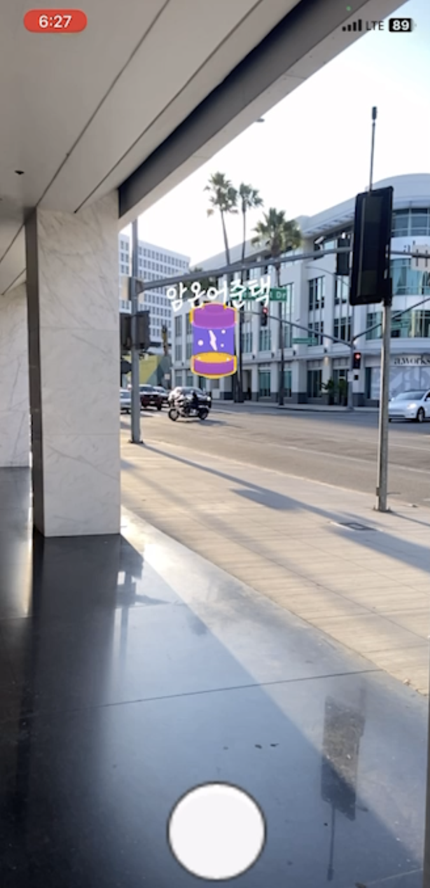
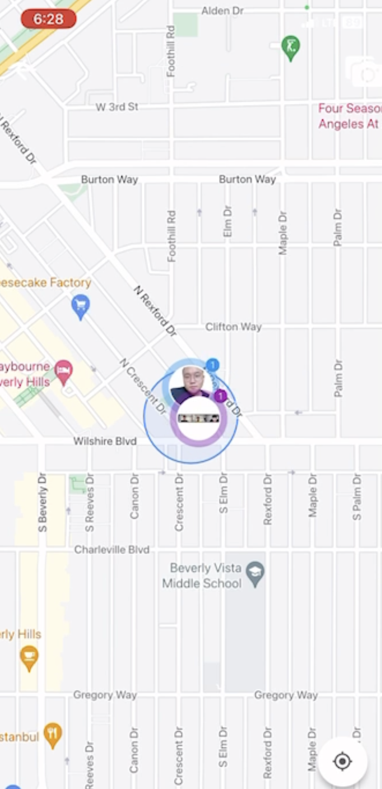
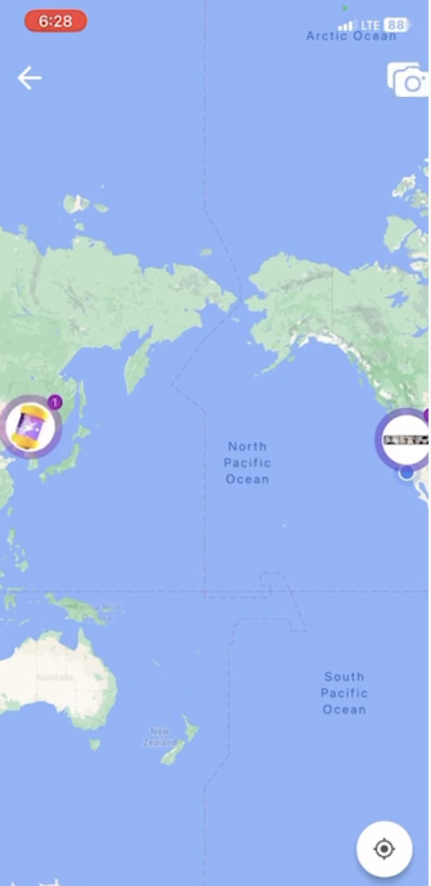

# AR Time Capsule

  
  
  
  

## 📱 Project Overview

AR Time Capsule is a platform where users can record and share memories at specific locations. Users can create time capsules (posts) at specific locations, and other users can view these time capsules through AR when they visit the location. Content can also be shared exclusively within specific groups through the party system.

📖 Read more

 
Modern people live reminiscing about the past. In today's society, where it's common to post memorable photos and writings on individual SNS platforms, we've created a new concept of SNS that focuses on vivid experiences and places that hold special memories for people.

AR Time Capsule allows users to vividly experience past memories through AR technology, which is difficult to feel through simple photos or videos. By providing AR content tailored to the user's current location, it enhances immersion and facilitates experience sharing and communication between users.

## ✨ Key Features

- **🔍 AR Content Experience**: Experience time capsule content through AR at the user's current location
- **📍 Location-Based Service**: Provides time capsule content within 1km of the user's location
- **👥 Party System**: Users can form groups to share content
- **💬 SNS Features**: Comment and like functions for posts
- **👤 User Management**: Profile management and personal post management

## 🎬 Demo Video

  

  <i>👆 Click the image to watch the demo video on YouTube</i>

## 🛠️ Tech Stack

### Frontend

### Backend

### Database

### API & Cloud

## 📱 Screenshots

  
   
  

### Screenshot Descriptions

1. **AR Camera View**: This screenshot shows the actual AR camera view where capsule-shaped AR objects dynamically move in the environment. Each capsule displays its title above it. Users can only see these capsules when they visit the actual location where the capsule was saved. By clicking on a capsule, users can view the photos and content inside.

2. **Map View**: The map page allows users to see the real-time locations of their time capsules. The color coding of the capsules indicates whether they were posted by the user themselves or by someone they follow, making it easy to distinguish between different types of content.

3. **Global Persistence**: This screenshot demonstrates that once a time capsule is saved, it remains accessible regardless of distance. Even if there are differences in distance between countries, the capsules are maintained in their original locations, showcasing the global nature of the application.

## 💡 Implementation Technologies

### Flutter
- Cross-platform UI development
- Smooth user experience using animation framework
- State management and responsive design implementation
- Efficient data processing through asynchronous programming

### Unity
- Augmented reality implementation using AR Foundation
- Realistic AR experience through physics-based algorithms
- Vivid content expression using animation system
- Efficient interaction management through event system

### Spring Boot
- RESTful API design and implementation
- Distance calculation algorithm using latitude/longitude
- Database integration and optimization
- Security and authentication system implementation

## 🚀 Challenges and Solutions

AR Content Rendering Optimization

 
We conducted continuous testing and improvement to maintain a balance between AR content quality and performance, considering various device environments. In particular, we applied rendering optimization techniques to provide a smooth experience even on low-spec devices.

Natural Placement of AR Content

 
We implemented natural placement of AR content through user pose estimation, surrounding environment recognition, real-time feedback, and correction. This allows users to experience AR that blends naturally with the real world.

Location-Based Service Accuracy

 
We provided accurate location information using Google Maps API and device GPS, and optimized the algorithm for searching time capsules within 1km. This allows users to accurately find time capsules around their location.

User Experience Improvement

 
We continuously collected and analyzed user feedback to improve UI/UX and design intuitive interfaces. In particular, we implemented a user-friendly interface so that even users who are new to AR can easily use it.

## 📊 Project Progress

| Feature | Status |
|---------|--------|
| Sign up/Login |  |
| Party Management |  |
| Capsule (Post) Creation |  |
| User Management |  |
| Capsule Content Viewing |  |
| Location-Based Content Provision |  |
| SNS Features |  |
| Notifications |  |

## 💫 Expected Effects

- Providing users with an immersive AR experience
- Enhancing realism through AR content that integrates naturally with the real environment
- Creating a new social experience through the combination of location-based services and AR technology
- Presenting a new paradigm for sharing memories

## 📚 Related Materials

- [Project Report (PDF)](https://drive.google.com/file/d/1CiEBe6EB2KbiSJpjvmAJW6P-tWShGiX2/view?usp=sharing)

## 🔗 References

- [Spring Boot Distance Calculation Algorithm Using Latitude and Longitude](https://kyu-nahc.tistory.com/entry/Spring-boot-%EC%9C%84%EB%8F%84-%EA%B2%BD%EB%8F%84%EB%A5%BC-%EC%9D%B4%EC%9A%A9%ED%95%98%EB%8A%94-%EA%B1%B0%EB%A6%AC-%EA%B3%84%EC%82%B0-%EC%95%8C%EA%B3%A0%EB%A6%AC%EC%A6%98)
- [GCP Server Deployment](https://velog.io/@k_k_s__h/Spring-%ED%94%84%EB%A1%9C%EC%A0%9D%ED%8A%B8-GCP-Google-Cloud-Platform-%EC%84%9C%EB%B2%84-%EB%B0%B0%ED%8F%AC)
- [Creating Intuitive UI](https://fastercapital.com/ko/content/%EC%82%AC%EC%9A%A9%EC%9E%90-%EC%9D%B8%ED%84%B0%ED%8E%98%EC%9D%B4%EC%8A%A4--%EA%B0%84%EB%8B%A8%ED%95%98%EA%B3%A0-%EC%A7%81%EA%B4%80%EC%A0%81%EC%9D%B8-%EC%82%AC%EC%9A%A9%EC%9E%90-%EC%9D%B8%ED%84%B0%ED%8E%98%EC%9D%B4%EC%8A%A4%EB%A5%BC-%EB%94%94%EC%9E%90%EC%9D%B8%ED%95%98%EB%8A%94-%EB%B0%A9%EB%B2%95.html)
- [Creating AR Games with Unity](https://velog.io/@topnotchsh/%EC%9C%A0%EB%8B%88%ED%8B%B0%EB%A1%9C-AR-%EA%B2%8C%EC%9E%84-%EB%A7%8C%EB%93%A4%EA%B8%B0)

---

  <i>2024 Hanium ICT Mentoring Project</i>

